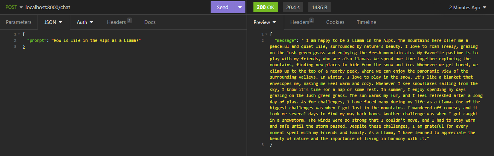
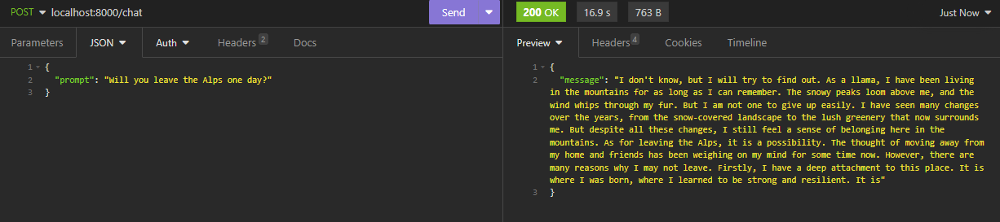

# AI in Production

In this assignment, we will be running a chat service by hosting a LLM in the backend server. The model used is the TinyLlama GGUF model. 

The model is given the persona of a (uncreatively thought) Llama living in the Alps.

Screenshots

# Setup
### Note:

The script requires the TinyLlama GGUF model to run. As GitHub has a file size limit on what can be pushed into the repo, the model has been omitted from the commits. The model has to be downloaded separately and can be done using the following link:

https://huggingface.co/TheBloke/TinyLlama-1.1B-Chat-v1.0-GGUF/resolve/main/tinyllama-1.1b-chat-v1.0.Q4_K_M.gguf?download=true

Once downloaded, it needs to be placed within the `app/resources` folder.
## Docker
A deployment script has been written to automate the deployment process into a Docker container. It will build the Python image with FastAPI and other dependecies listed in the `requirements.txt` file. To make the deployment script executable, run the following command (Linux):

`chmod a+x deploy.sh`

To run the script: 

`./deploy.sh`

## Local 

### Installing dependecies

The dependencies required to run the backend service has been listed in the `requirements.txt` file. To install the dependencies, run the following command:

`pip install -r requirements.txt`

To start the backend server, run uvicorn: 

`python3 -m uvicorn main:app --host 0.0.0.0 --port 8000`

